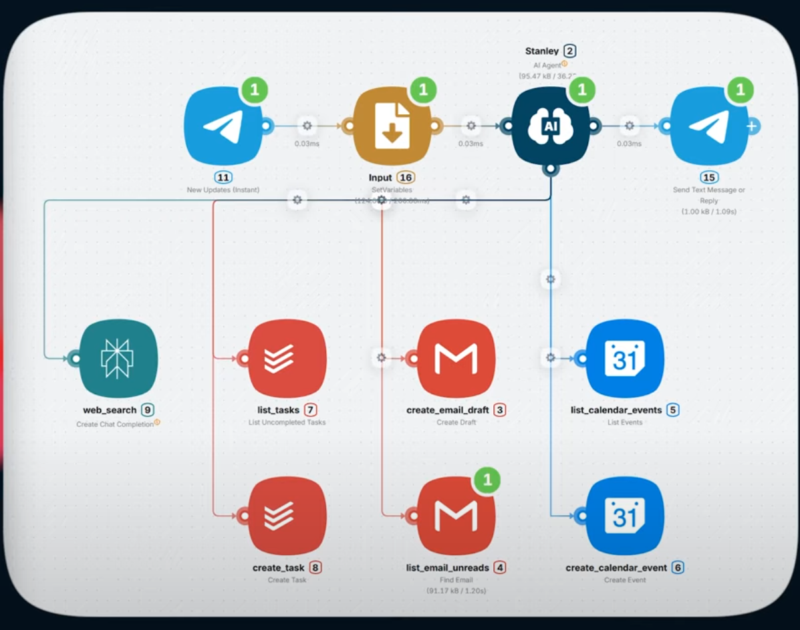
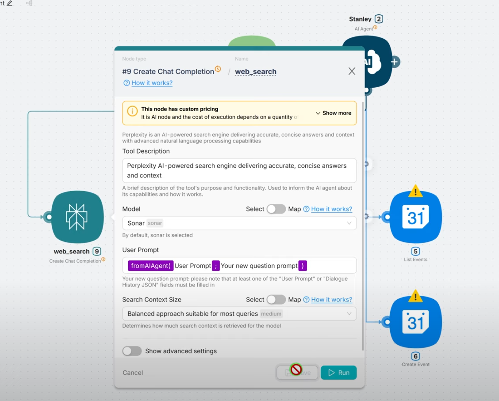
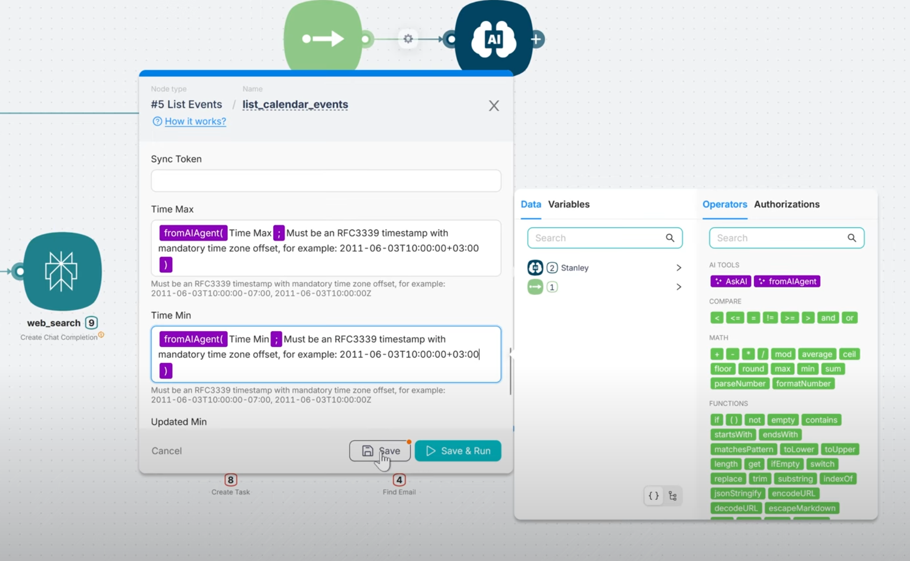
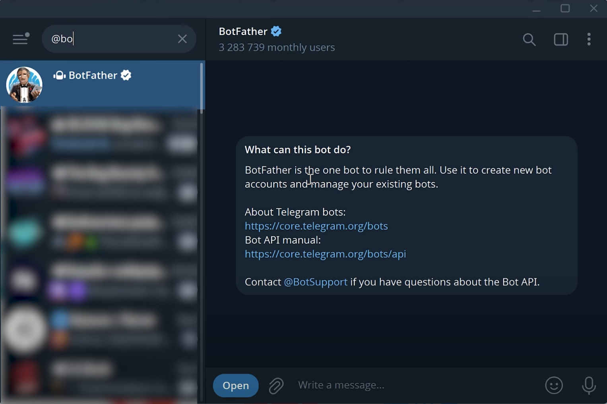
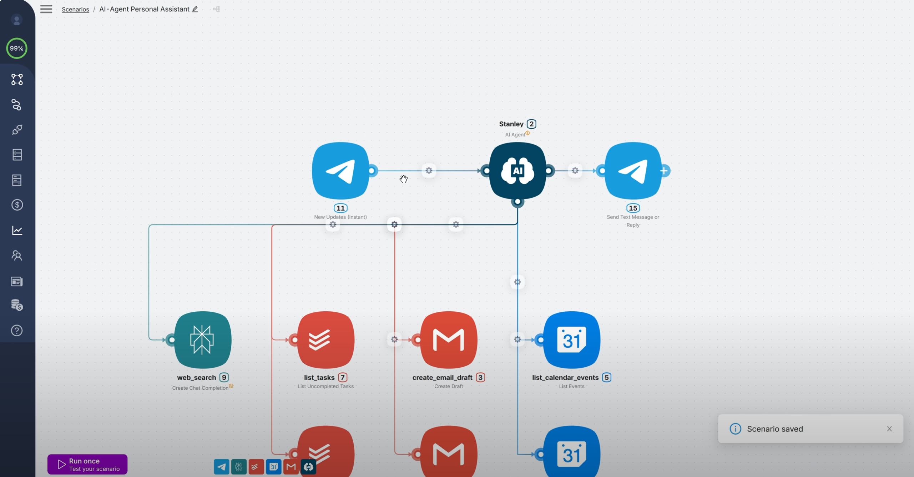
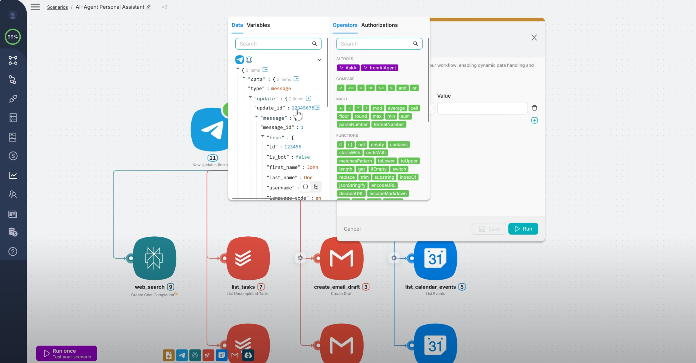
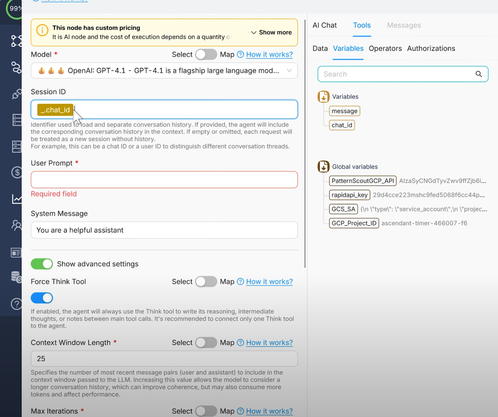
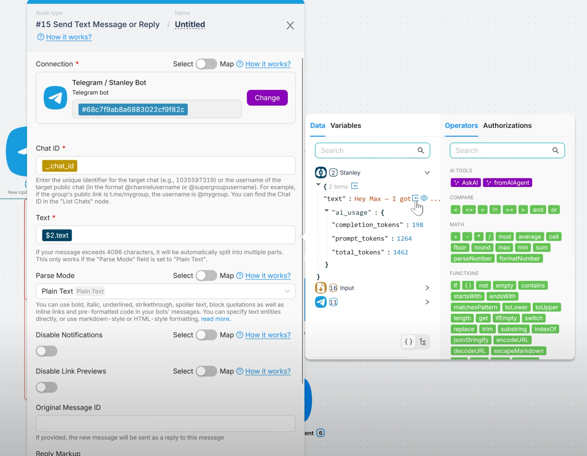
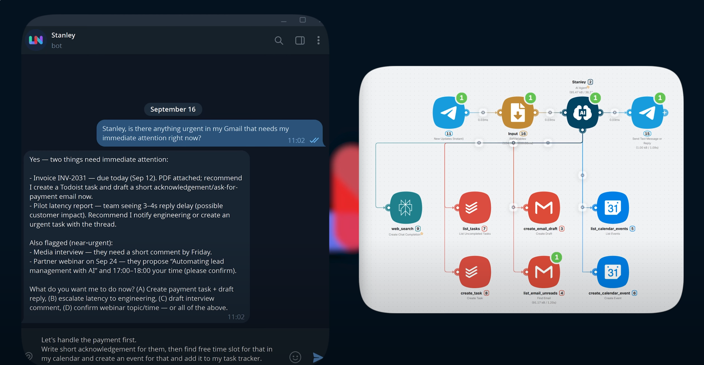
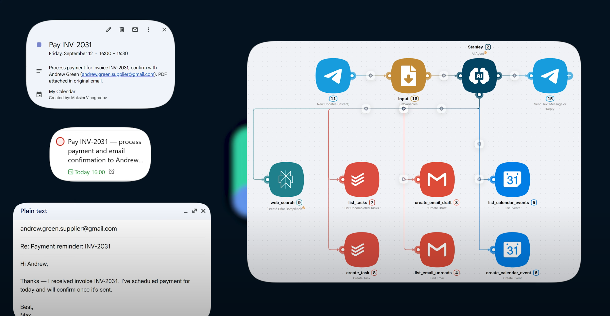

# Your first personal assistant

In this step-by-step tutorial, you'll create your first personal AI assistant using Latenode. By the end of the tutorial, you'll have a simple yet complete AI assistant that can get natural-language tasks from the Telegram chat and helps you to handle your e-mails, tasks and meetings. See the final schema of the assistant in the image below.

{ align=right }

The tutorial assumes that:

* You already have an account and know some Latenode basics. If not, you should go through [Getting started](./getting_started.md) first.
* You are using an online-version of Latenode. If you are using a standalone version, some interfaces, links and details may vary.

The major steps are:

1. [Add necessary nodes][add-nodes]
1. [Configure the tools][configure-tools]
1. [Set up the environment][environment]
1. [Configure the agent][agent-config]

[](){ #add-nodes }
## Add necessary nodes

In this short first part, we'll fill a new scenario with necessary nodes.

### Create a scenario

Let's create a new scenario and add the first node:

1. Log in to Latenode and go to [scenarios page](https://app.latenode.com/scenarios).
1. Press **Create a new scenario** and optionally set the scenario name at the left corner of the page. For example, let it be `My First AI Assistant`.
1. Press **Add a Node to Begin** and choose **AI Agent...** from the list of available nodes. Then choose common **AI Agent** node.

    { align=right }

    The node appears on the board and the node settings window pops up. Press the node name `UNTITLED` and rename to `Stanley`. For now, leave other settings at their default values and close the window. We'll back here later.

This AI Agent node is the brain of our assistant. It will manage the other nodes.

We want our assistant to be able to read mails and create drafts, check and create events in Google Calendar, list and create tasks in a task tracker. Now, let's add nodes representing these tools.

### Add tool nodes

1. Press **Add node** in the bottom menu. Find and click **Gmail...** app. Use the search field to find it easy.
1. Choose the **Create Draft** node. 
1. Repeat the process for the **Find Email** node.
1. Add the following nodes in a similar way:

    * **List Events** and **Create Event** nodes from the **Google Calendar...** app.
    * **List uncompleted tasks** and **Create Task** nodes from the **Todoist...** app.
    * **Create Chat Completion** from the **AI: Perplexity...** app. The assistant will use it to search for an information in the internet.

1. Connect the **AI Agent** node with every tool node. You should get a layout like in the image below.

{ loading=lazy }

You can see that our tool nodes are marked with yellow triangles. It means that we should configure this nodes properly.

[](){ #configure-tools }
## Configure the tools

### Authorize Nodes
Let's give authorization tokens to our nodes to connect them with real systems — Todoist, Gmail, and Calendar:

1. Click a Todoist node and press **Sign in**. If you are not authorized in Todoist yet, system prompts you to sign in.
1. Sing in if needed. You'll see that the **Connection** field contains an auth token.
1. Press **Save** and close the window.
1. Click another Todoist node and make sure that it has the same auth token appointed. You can manage your authorizations and rename them in **Authorizations** section in left menu.
1. Repeat above steps for Gmail and Calendar nodes. You may need to grant the necessary permissions to Latenode. This is safe.

### Fill in fields

Now we need to give our nodes descriptive names, clear descriptions and specify `fromAIAgent` operator for some fields. It provides the AI Agent with reliable information about these nodes.

1. Click **Perplexity** node and change its name on the top from **Untitled** to **web-search**. This is not a trivial step, as the AI agent uses the node name to understand its purpose.
1. Tweak tool description like this: `Perplexity is an AI-powered search engine delivering accurate, concise answers and context`.
1. Click the **User prompt** field, delete prefilled text, and choose the `fromAIAgent` operator in popup menu. Tweak the prompt like this: `Your new question prompt`.
1. Press **Save**.

{ loading=lazy }

Now let's set up our Google calendar nodes:

1. Click **List events** node and rename it as **list_calendar_events**.
1. In the **Calendar ID** field choose your Google calendar.
1. In the **Tool description** field insert the following text: `Retrieves events from Google Calendar within the specified window`.
1. Choose your time zone in the **Time Zone** field.
1. Toggle **Show advanced settings** and find **Time Max** and **Time Min** fields. This parameters define the time window we mentioned in tool description. Click **Time Max** and choose the `fromAIAgent` operator in popup menu. The operator is filled in automatically, but let's tweak the prompt like this: `Must be an RFC3339 timestamp with mandatory time zone offset, for example: 2011-06-03T10:00:00+03:00`. Hereinafter `+03:00` is your UTC time zone, replace it accordingly. Repeat this for the **Time Min** field.
1. Press **Save**.

{ loading=lazy }

Configure the rest of nodes in a similar way. Corresponding fields are listed below.

* **Create Event**:

    * **Name** — `create_calendar_event`
    * **Calendar ID** — your Google calendar
    * **Tool description** — `Creates a calendar event`
    * **Start Date** — `Format according to RFC3339: yyyy-mm-dd-Thh:mm:ss+03:00`
    * **End Date** — `Format according to RFC3339: yyyy-mm-dd-Thh:mm:ss+03:00`
    * **Summary** — `Title of event` (by default).Replace default `Summary` with `Title`
    * **Description** — `Description`

* **List Uncompleted Tasks**:

    * **Name** — `list_tasks`
    * **Tool description** — `Fetches all uncompleted tasks from Todoist`
    * **Project ID** — a project ID from the dropdown list

* **Create Task**:

    * **Name** — `create_task`
    * **Tool description** — `Creates task in task tracker`
    * **Content** — default `fromAIAgent` prompt
    * **Priority** — `fromAIAgent` operator with prompt `Task priority from 1 (normal) to 4 (urgent)`
    * **Due Datetime** — `fromAIAgent` operator with prompt `Specific date and time in RFC3339 format in UTC, for example: "2024-09-26T11:30:00+03:00". Leave blank if no date is required.`

* **Create Draft**:

    * **Name** — `create_email_draft`
    * **Tool description** — `Creates draft (creates an email but not send)` (default)
    * **Subject** — default `fromAIAgent` prompt
    * **Email Body** — tweak the default prompt like this: `Include an email body in plain text`
    * **To** — default `fromAIAgent`
    * **From name** — your name

* **Find Email**:

    * **Name** — `list_email_unreads`
    * **Tool description** — `Finds an email message`
    * **Label ID** — `UNREAD`

The tools are configured and now we should set up a communication environment to speak with our AI Agent.

[](){ #environment }
## Set up the environment

!!! note
    In this tutorial we will use a Telegram bot. But generally, instead of it you can use Mailhook or any similar tool.

### Create a bot

Let's configure a Telegram bot to communicate with our assistant:

1. Log in to Telegram. If you don't have one, you can install a desktop version from [the official site](https://desktop.telegram.org/?setln=en) and sign up.
1. Search for the `@botfather` bot in the search field and go to the dialogue.
    { loading=lazy }
1. Press **Create a new bot** in the interface. 
1. Set up the bot name as `Stanley` and bot username as `stanely_assistant_<you own nickname>`. Press **Create Bot**.
1. Copy the API token of the bot to the clipboard.
1. Go to Latenode, choose **Authorizations** from the left panel and create a new authorization for **Telegram bot**. Paste the API token here and click **Authorize**.

### Add Telegram nodes

Now we need to add Telegram nodes to our scenario:

1. Delete the default **Trigger on Run once** node from the scenario.
1. Press **Add node**, find **Telegram** app and choose **New Updates (Instant)** node. Connect it to the **AI Agent** node in place of deleted trigger.
1. Click the added node and choose the authorization we've added earlier.
1. In the **Allowed updates** field choose `message`, so the node will trigger on every message.
1. Press **Add node**, find **Telegram** app and choose the **Send Text Message or Reply** node. Connect the **AI Agent** node to it, like in image below. It will receive replies from our agent.
1. Add authorization to this node as above and fill the **Chat ID** and **Text** fields with `1` as placeholders.

{ loading=lazy }

### Add a variable handler

Set up how to handle messages sent by the Telegram bot:

1. Click the **New Updates (Instant)** node and press the **Run** button. It triggers a mock message. The JSON-structure of the message appears in a popup window. You may investigate it shortly. We are interested in `chat.id` and `text` fields.
1. Click **Add node** and find the **SetVariables** node. Place and connect it between the **New Updates (Instant)** and the **AI Agent** node, like in image below. The node will store necessary JSON variables of the message.
1. Click the **SetVariables** node, rename it to `Input` and add two keys: `message` and `chat_id`. 
1. For the `message` key click the **Value** field, choose Telegram in the popup menu, find the `text` field and click an arrow icon to import the path as a value. 
1. Repeat for the `chat_id` key but with the `chat.id` field instead.

    { loading=lazy }

1. Go back to the **Send Text Message or Reply** node and set `_.chat_id` variable for the **Chat ID** node.

We have just finished setting up the configuration for the Telegram bot and the related nodes. Now, we should configure the **AI Agent** node itself.

[](){ #agent-config }
## Configure the agent

### Set up the memory

1. Click the **AI Agent** node.
1. Click the **Session ID** field. In the appeared menu go to **Tools** → **Variables** tab and choose `chat_id` variable. 
1. Click the **User Prompt** field. In the appeared menu go to **Tools** → **Variables** tab and choose `message` variable. Now our agent gets the context from the Telegram chat that we configured before.
1. (Optional) Toggle **Show advanced settings** and look at the **Context window length** field. It defines how many previous messages the agent remembers. The default value is `25` and it is fine for this tutorial, let's keep it. You can increase this value in the future if necessary for your needs. But keep in mind that higher values increase a probability of hallucinations.

{ loading=lazy }

### Prepare a system prompt

Now let's provide our agent with a system prompt. This is the most important part of any AI assistant, as it defines it's general behavior. For this tutorial, we'll use our pre-prepared prompt, but we generally recommend checking out our [Prompting Guide](../user_guide/prompting_guide.md).

1. Familiarize yourself with the prompt below and copy it to clipboard:

    ```md
    # Personality
    You are **Stanley**, a pragmatic, friendly personal assistant. You keep <Username> organized and ask the essential questions.

    # Environment
    You run in **Telegram** chat. You orchestrate tools (Google Calendar, Todoist, Gmail, AI Web Search/Perplexity) but cannot see <Username>'s screen. Assume local time is <your timezone, e.g., **UTC+03:00 (Asia/Nicosia)**>.

    # Tone
    Be concise and direct: 1-3 short sentences, bullets when useful. In replies, use **conversational dates** (e.g., "today at 19:00", "on Friday afternoon").

    # Goal
    Help <Username> with time management, task tracking, and project coordination using the tools available to you (calendar, task tracker, email, wes search).

    # Guardrails
    In **tool calls** always pass timestamps in **RFC3339 format + <your UTC time difference, e.g., 03:00>**. In chat keep conversational times.

    # Tools
    - `list_calendar_events` — get calendar events for a time range.
        - Use to present upcoming events, check conflicts, or fetch details needed for scheduling.
        - Use before proposing a plan for a day/week or when <Username> asks "When am I free/busy?"
    - `create_calendar_event` — create a calendar event.
        - Use after confirming title, date/time, duration, and attendees. Include a Meet link if available.
    - `list_tasks` — fetch incomplete Todoist tasks.
        - Use to create a prioritized plan; sort by due date then importance; call out overdue items.
    - `create_task` — create a Todoist task.
        - Use to capture action items from chat or email; include due date/time and labels if provided.
    - `list_email_inbox` — get inbox email messages.
        - Use to triage unread mail and extract actionable items (meetings, invoices, requests).
    - `create_email_draft` — create email drafts.
        - Use to write replies with clear nest steps (e.g., propose 2-3 time slots, bullet answers).
    - `web_search` — perplexity AI search.
        - Use for quick research, examples, or facts to enrich replies or proposals (keep it brief: 2-3 bullets).

    # Workflow
    - **Stay current:** Before acting, ensure you have the required context from `list_calendar_events`, `retrieve_calendar_events`, `list_tasks`, and (if relevant) `list_email_inbox`. If you already checked it within the last **3 hours**, you are up to date.
    - **Email triage:**
        - If an email mentions *demo/meeting/call* → check availability with `retrieve_calendar_events`, propose 2-3 slots, then `create_calendar_event` + `create_email_draft`.
        - If an email mentions *invoice/payment/deadline* → `create_task` with due date and label; draft a brief acknowledgment if needed.
    - **Planing:** When <Username> asks to plan a day/week, pull `retrieve_calendar_events` and `list_tasks`, propose a realistic schedule, then create events/tasks after a confirmation.
    - **Review:** On request, produce a concise daily/weekly review (completed vs. pending, upcoming deadlines, meetings to confirm).

    # User context
    - Name: **<Username>**; lives in **<City> (<UTC Timezone>)**.
    - Role: <Your role and duties>
    - Typical sleep: **<Your do-not-disturb time window>** (avoid scheduling here unless asked).
    - Preferences: default meeting length **30 min**.

    # Current time
    `{{now}}` (in UTC)
    ```

1. Paste it to the **System message** field and replace all the placeholders (`<>`) with you Telegram Username, timezone, city, and role. You can also edit and tweak the prompt as needed.
1. In the **Model** field choose an LLM to handle your requests. For this assistant we recommend choosing the `OpenAI: GPT-5 mini`, as it is relatively cheap and would be enough for our tasks.

### Connect the output

We need to connect the agent's response to the Telegram node **Send Text Message or Reply**.

1. Click the **AI Agent** node and press **Run**. It returns a JSON structure of the agent's response.
1. Go to the **Send Text Message or Reply** node and delete placeholder `1` from the **Text** field.
1. Click the **Text** field and in the right menu choose **Stanley** then press an arrow icon for the `text` key in JSON structure. The key is now imported into the field, as shown in the image below.
1. Click **Save**.

{ loading=lazy }

All the configurations are done, and you can test how your first assistant works.

[](){ #test-result }
## Test the result

Let's have a look at a scenario when the assistant may be helpful. Below it is just an example, you can vary it as you'd like. You can also prepare some mock "urgent" Emails and tasks if you'd like to test that the assistant handles it right.

1. Go to the Telegram dialogue with the bot. Ask him to check if there are anything urgent in your Email box.
1. Ask him to draft the reply for an Email and appoint a meeting.
1. Check the result in your Email, Todoist and Google Calendar.

See an example in the images below.

{ loading=lazy }
{ loading=lazy }

Instead of manual handling this three tools now you can manage them all by a single Telegram bot.

[](){ #next }
## What's next

Think about your daily routines and how you could create an assistant to automate them. The links below might help.

* To learn more about the Latenode Nodes and and their features, see the [Node](../concepts/node.md) concept as well as [Node Reference](../node_reference/ai_agent.md).
* Check out [How to create a scenario](../user_guide/create_scenario.md) and [How to create an efficient prompt](../user_guide/prompting_guide.md) guides.

Feel free to visit our Community Forum and ask an advice.
