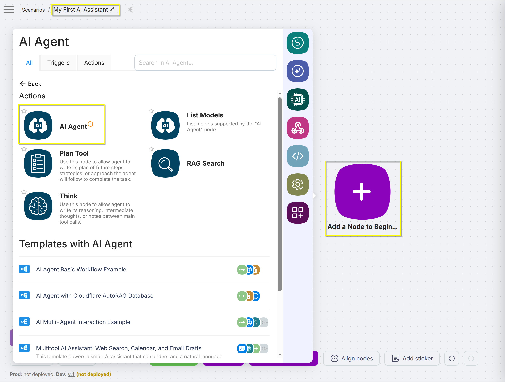
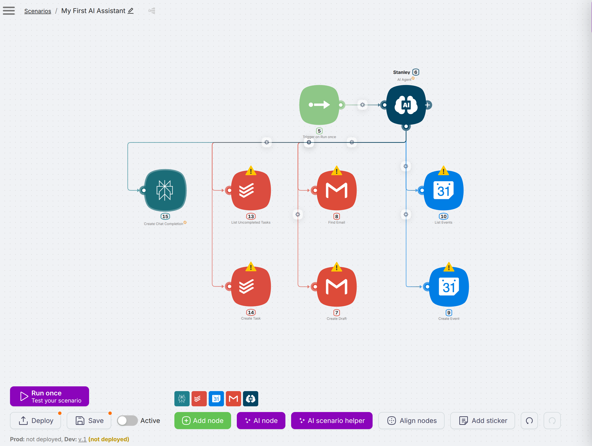

# Your first personal assistant

In this step-by-step tutorial, you will create your first personal AI assistant with Latenode. By the end of the tutorial, you will have a simple yet complete AI assistant that can get natural-language tasks from the Telegram chat and helps you to handle your e-mails, tasks and meetings. Look at the final schema of the assistant at the image below.

{ loading=lazy }

The tutorial assumes that you already have an account and know some Latenode basics. If not, you should go through [Getting started](./getting_started.md) first.

It also assumes that you are using an online-version of Latenode. If you are using a standalone version, some interfaces, links and details may vary.

The major steps are:

1. [Add necessary nodes][#add-nodes]
1. [Connect the tools][#connect-tools]
1. [Configure the tools][#configure-tools]
1. [Decide on the environment][#environment]
1. [Fine-tune the agent][#finetune]

{ #add-nodes }
## Add necessary nodes

In this short first part, we'll just fill a new scenario with necessary nodes.

Let's create a new scenario and add the first node:

1. Log in to Latenode and go to [scenarios page](https://app.latenode.com/scenarios).
1. Press **Create a new scenario** and optionally set the scenario name at the left corner of the page. For example, let it be `My First AI Assistant`.
1. Press **Add a Node to Begin** and choose **AI Agent...** from the list of available nodes. Then choose common **AI Agent** node.

    { align=right }

    The node appears on the board and the node settings window pops up. Press the node name `UNTITLED` and rename to `Stanley`. For now leave other settings by default and close the window, we will back here later.

This AI Agent node is the brain of our assistant, who will manage the other nodes. We want our assistant to be able to read mails and create mail drafts, check and create events in Google Calendar, list and create tasks in the task tracker.

Now let's add tool nodes to manage:

1. Press **Add node** in the bottom menu. Find and click **Gmail...** app. Use the search field to find it easy.
1. Choose the **Create Draft** node. 
1. Repeat the process for the **Find Email** node.
1. Add the following nodes in a similar way:

    * **List Events** and **Create Event** nodes from **Google Calendar...** app.
    * **List uncompleted tasks** and **Create Task** nodes from **Todoist...** app.
    * **Create Chat Completion** from **AI: Perplexity...** app. We will explain this point later.

1. Connect the **AI Agent** node with every tool node. You should get a layout like in the image below.

{ loading=lazy }

You can see that our tool nodes are marked with yellow triangles. It means that we should set up this nodes properly — connect them to real systems.

{ #connect-tools }
## Connect the tools

{ #configure-tools }
## Configure the tools

{ #environment }
## Decide on the environment

{ #finetune }
## Fine-tune the agent

